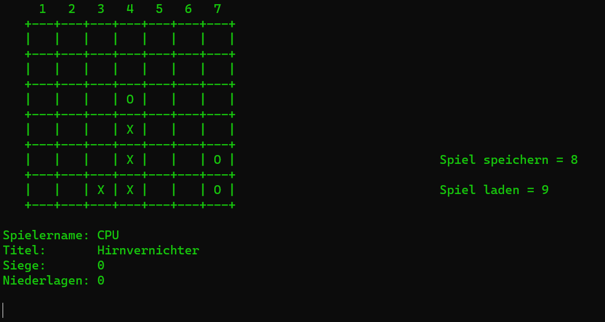

# 4 Gewinnt / Connect-four
> A command-line based connect-four application. Since it was one of my first programming projects (2013) as a teenager, the design as well as the runtime of some functions kind of sucks. :) It also seems like the "Load Game"-functionality isn't implemented yet. 

## Overview
* [Technologies](#technologies)
* [Features](#features)
* [Current status](#current-status)

## Technologies 

The application is written in C and as far as I remember doesn't inlcude any frameworks.

## Features
After starting the application you'll see the home menu from which you can choose 4 options. 

### Option 1: New Game / Neues Spiel

If you choose to start a new game you'll be asked if you'd like to play against the computer or with an other human player. 

#### Option 1: Game against CPU / Spiel gegen CPU

If you choose this option you'll have to enter an username and a title before the game starts

After that, the application prints a board and asks you to choose a row (Keys 1-7).

#### Option 1: Game against (other) player / Spiel gegen Spieler

If you wish to play against an other player you can choose this option. It basically works the same as option 1.

### Option 2: Load Game / Spiel laden

Isn't fully implemented yet.

### Option 3: Instruction / Anleitung

If you've never played Connect-four / 4 Gewinnt you may want to read the instructions. 

## Current status
It seems like I haven't fully implemented the functionality for saving/loading a game. I may re-implement the whole thing someday.

